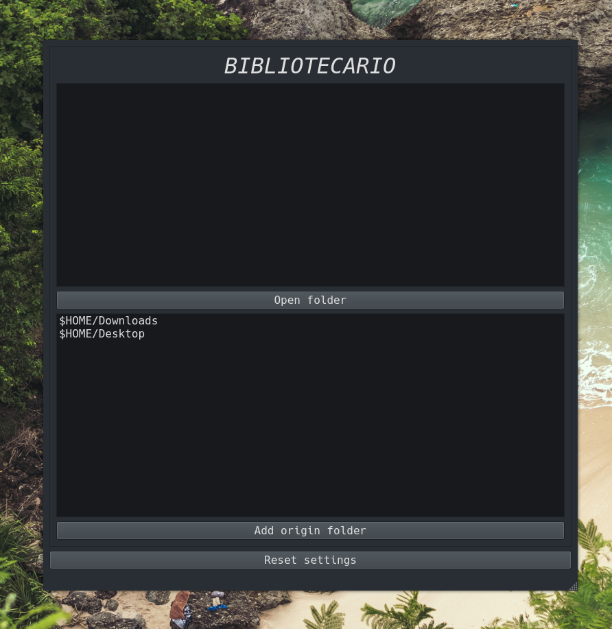

[](https://github.com/PyCQA/pylint)

# bibliotecario
A GUI app that organizes your files through easily created filters.

## Screenshots



## Table of Contents

- [Screenshots](#screenshots)
- [General Info](#general-information)
- [Technologies Used](#technologies-used)
- [Features](#features)
- [Setup](#setup)
- [Project Status](#project-status)
- [To do](#todo)
- [Contact](#contact)
- [License](#license)

## General Information

<!--- Provide general information about your project here.-->

The gold is to provide a GUI to setup how files should be organized automatically in your system. The files will move from what we call *origin folders* to *destination folders* through *Filters* which are a way to describe what's the trigger and how should the file be organized; *Filters* are [regex](https://docs.microsoft.com/en-us/dotnet/standard/base-types/regular-expression-language-quick-reference) expressions basically, and the specific type of filters *'name'* and *'format'* are just some particular regex. Eventually i'd be great to provide some backup system.

## Technologies Used

- Python 3.10.5.
- PyQT5 ([documentation](https://www.riverbankcomputing.com/static/Docs/PyQt5/))

## Features

<!-- List the ready features here: -->

- [ ] Organization of files.
- [ ] Backup of files.

<!-- ## Setup -->
<!-- You can get the compiled version that matches your OS [_here_](https://drive.google.com/drive/folders/1H64d7qW_NE-Uzm5RjM3dDNjM7AF094wG?usp=sharing) -->
<!-- - If you just want to make your own changes or contribute first clone this repo, inside the folder run: `yarn` and then `yarn start` -->
<!-- - To package for production (just in current OS run): `yarn package` -->
<!-- - To package for production (for an specific OS ) run: `yarn package --mac` -->

## Project Status

Project is: _in progress_.

<!-- ## Room for Improvement-->
<!--Include areas you believe need improvement / could be improved. Also add TODOs for future development.-->

<!--Room for improvement:-->
<!--- Improvement to be done 1-->
<!--- Improvement to be done 2-->

## Development
To make the GUI we use [*designer-qt5*](https://www.riverbankcomputing.com/static/Docs/PyQt5/designer.html)
### With Makefile
```bash
make
```

## TODO:

- [ ] Add destination folders filters.
- [ ] Add destination folders selection.
- [ ] Add folders watchers.
- [ ] Handle language selection.
- [ ] Add a blacklist filter for files in origin filters maybe?.

## Contributors
[@TomiVidal99](https://github.com/TomiVidal99/) (https://tomas-vidal.xyz/)

## License

This project is open source and available under the [MIT License]().
